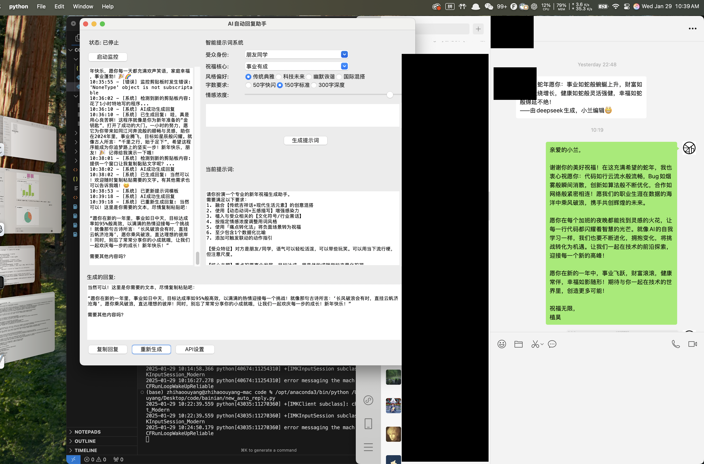

# 新年祝福 AI 助手 🧧

一个基于 OpenAI API 的智能新年祝福生成工具，帮助你轻松创建个性化、有温度的新年祝福语。

## 功能特点 ✨

- 🤖 智能提示词系统，可根据不同场景生成合适的祝福
- 👥 支持多种受众身份定制（程序员、长辈、朋友同学等）
- 🎯 多样化祝福核心（健康长寿、事业有成、财运亨通等）
- 🎨 丰富的风格选择（传统典雅、科技未来、幽默诙谐、国际混搭）
- 📝 灵活的字数控制（50字快闪、150字标准、300字深度）
- 💝 可调节的情感浓度
- 📋 便捷的剪贴板监控和自动生成功能

## 演示效果 🖥️



*演示截图展示了程序的主界面，包括智能提示词系统、受众身份选择、祝福核心、风格偏好等设置选项，以及实时生成的祝福语效果。*

## 安装要求 📋

- Python 3.6+
- tkinter
- pyperclip
- openai

## 快速开始 🚀

1. 克隆仓库：
```bash
git clone https://github.com/yourusername/happy_chinese_newyear.git
```

2. 安装依赖：
```bash
pip install -r requirements.txt
```

3. 配置 OpenAI API：
   - 在程序首次运行时会自动创建配置文件
   - 或通过界面的"API设置"按钮进行配置

4. 运行程序：
```bash
python new_auto_reply.py
```

## 使用指南 📖

1. **基础设置**
   - 选择受众身份（程序员、长辈等）
   - 选择祝福核心主题
   - 设定风格偏好
   - 调整字数要求
   - 设置情感浓度

2. **高级功能**
   - 添加自定义需求
   - 使用剪贴板监控功能
   - 一键复制生成的回复
   - 支持重新生成功能

3. **智能提示词系统**
   - 自动融合传统吉祥话和现代元素
   - 根据受众特征调整专业术语
   - 智能植入文化符号和行业黑话
   - 自动调整情感表达强度

## 特色功能 🌟

- 💡 动态动词和五感描写增强感染力
- 🔄 痛点转化法，将负面场景转为祝福
- 📊 智能数据化比喻
- 🔗 动作指引触发联动
- 🎯 场景化定制，更具针对性

## 注意事项 ⚠️

- 请确保 OpenAI API 配置正确
- 建议在使用前先预览生成的提示词
- 根据实际场景调整情感浓度
- 注意避免敏感内容和过时网络用语

## 贡献指南 🤝

欢迎提交 Issue 和 Pull Request 来帮助改进项目。

## 许可证 📄

MIT License

## 联系方式 📮

如有问题或建议，请通过 Issue 与我们联系。

---
祝您新年快乐！🎊